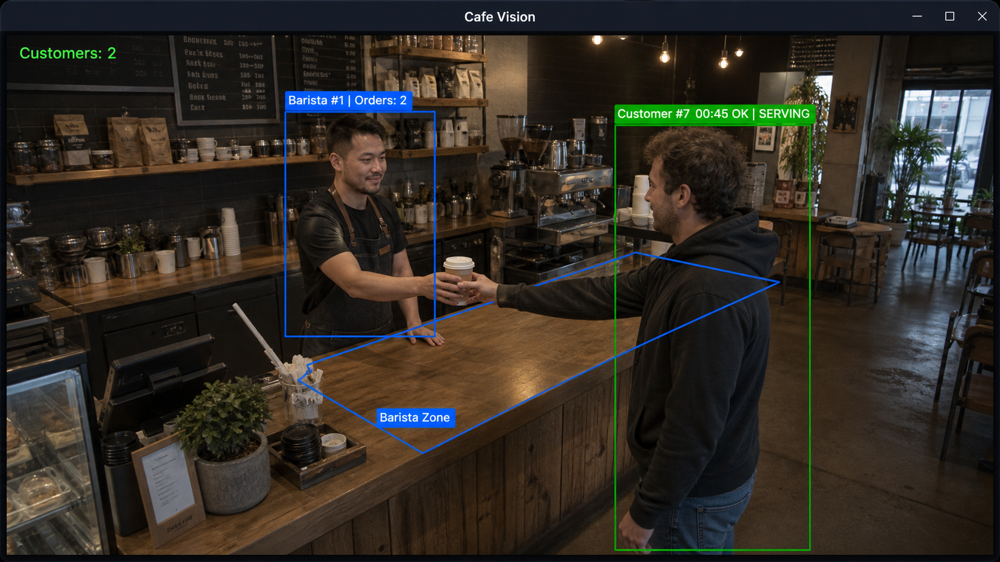
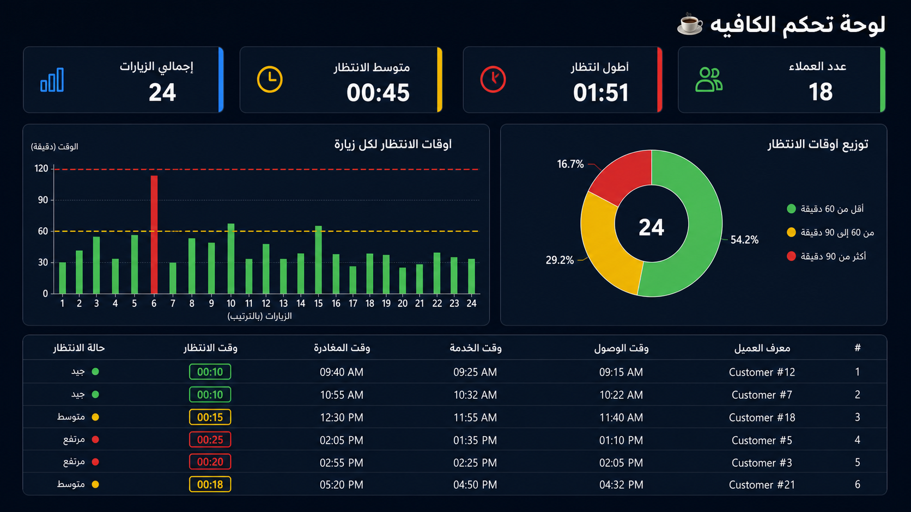
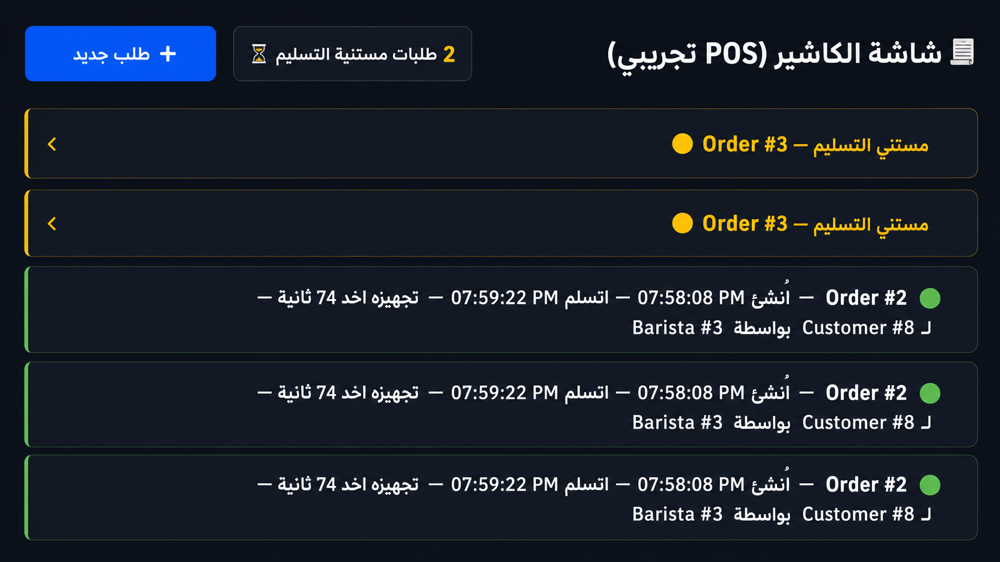

# ☕ Cafe Vision — AI-Powered Café Operations & Analytics Platform

Transform any regular webcam or CCTV feed into a smart operations system:
it tracks customers, measures real waiting times, recognizes staff by
appearance (no face recognition needed), links deliveries to real POS
orders, and visualizes everything on a live dashboard.


## 📸 Preview

| Live View | Dashboard | POS |
| :---: | :---: | :---: |
|  |  |  |

## 🎯 Features

### Customer Intelligence
- 👤 **Detection & Tracking** — every visitor gets a permanent ID (YOLOv11 + ByteTrack)
- ⏱ **Live wait timer** — color-coded over each customer: 🟢 OK → 🟡 WAITING → 🔴 ALERT (thresholds adjustable in code)
- 🧠 **Camera-covered detection** — freezes tracking instead of losing IDs
- 💾 **Persistent memory** — customer numbering survives restarts (SQLite)

### Staff Recognition & Performance
- 🎓 **Barista enrollment** — press `E` once, the system learns the staff's
  clothing signature (HSV histogram) and recognizes them **anywhere in frame,
  even after restart** — no face recognition, privacy-friendly
- 🍳 **Automatic fallback** — anyone staying in the barista zone becomes staff
- 📦 **Real delivery counting** — a hand-over signal (cup detection / counter dwell)
  is **confirmed only when the customer leaves the frame** — edits & returns
  don't double-count
- 🔗 **POS-linked orders** — every confirmed delivery is matched to a real order
  from the cashier screen

### Operations & Analytics
- 🧾 **Built-in POS screen** — creates pending orders like a real cashier
  (swap for a real POS integration later — same database schema)
- 📊 **Live dashboard** — visits, average wait (in Arabic readable format),
  longest wait, status distribution, peak hour, barista leaderboard
- 🗄 **Zero-setup storage** — SQLite + JSON, works fully offline

### Camera & Model
- 📷 **Any camera** — laptop webcam (`0`) or IP/RTSP surveillance camera
- 🤖 **Upgradable models** — `yolo11n` (fast) → `yolo11s` (accurate) →
  `yolo11m/l` (production GPU/Edge)
- 🛡 **Zone drawing** — interactive 4-point polygon with transparent fill
- ⚡ **FPS meter** — real-time performance display

## 🛠 Tech Stack

| Layer | Technology |
| :--- | :--- |
| Detection & Tracking | YOLOv11 + ByteTrack (Ultralytics) |
| Staff Re-ID | HSV clothing signatures (numpy) |
| Video Processing | OpenCV |
| POS & Dashboard UI | Streamlit + Plotly |
| Storage | SQLite + JSON |

## 🚀 How to Run

```bash
# 1. Install dependencies
pip install ultralytics opencv-python streamlit plotly numpy

# 2. Terminal 1 — camera + analytics engine
python step6.py

# 3. Terminal 2 — cashier (POS) screen
streamlit run pos.py

# 4. Terminal 3 — live dashboard
streamlit run dashboard.py
```

### First-run setup
1. **Draw the barista zone**: click 4 corners around the counter → `ENTER`
2. **Enroll a barista**: staff member stands in frame → press `E` →
   their clothing signature is saved permanently
3. Done — customers and staff are tracked automatically from now on

### Keyboard shortcuts (camera window)
| Key | Action |
| :--- | :--- |
| `E` | Enroll the person in frame as a barista |
| `Q` | Quit |

## 🧭 Roadmap

- [ ] Multi-zone editor (entrance / queue / pickup areas)
- [ ] Alerts & notifications (long wait, idle staff while customers wait)
- [ ] Real POS integration (API / webhooks instead of the demo screen)
- [ ] Face recognition for named employee tracking
- [ ] Re-identification (ReID) to survive long occlusions
- [ ] Multi-branch SaaS dashboard
- [ ] Predictive staffing (peak-hour recommendations)

## 🏗 Project Structure

```
cafe-vision/
├── step6.py        # Full analytics engine (detection → tracking → delivery → enrollment)
├── pos.py          # Cashier screen — creates pending orders
├── dashboard.py    # Live analytics dashboard
├── step1-5.py      # Learning steps: camera → detection → tracking → storage
├── tracker.yaml    # ByteTrack tuning (stability settings)
├── screenshots/    # Preview images
└── cafe.db / zones.json   # Runtime data (auto-created, git-ignored)
```

## 🎬 How the delivery flow works

```
Cashier (POS)  →  creates Order #N as "pending"
      +
Camera  →  detects hand-over signal (cup in customer's hands
           OR 4s dwell next to a barista)
      ↓
System  →  marks customer as "SERVING" (suspected, not confirmed)
      ↓
Customer  →  leaves the frame (after any edits/returns)
      ↓
System  →  CONFIRMS: Order #N → Customer #X by Barista #Y ✅
```

---

*Built as a zero-budget MVP on a single laptop — proving that a café's
existing cameras can become an operations intelligence system.*